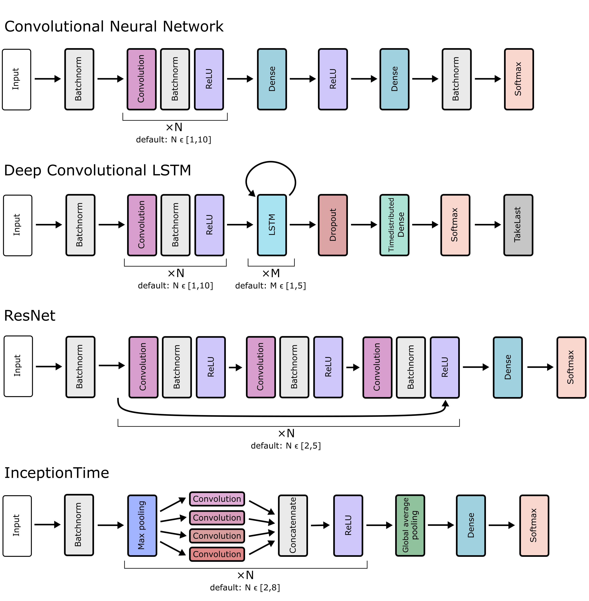

Technical documentation
=======================

This page describes the technical implementation of mcfly and the choices that have been made.

Hyperparameter search
---------------------
The function :func:`~mcfly.modelgen.generate_models` generates a list of untrained Keras models based on the shape of the input data.
Key function arguments include *number_of_models to specify the number of models that need to be generated, *x_shape* to specify the shape of the input training data,
and number_of_classes to specify the number of classes in the data labels. An additional set of arguments, with default values, provide more control for advanced users.

The model architectures generated in this previous step are compared with the function :func:`~mcfly.find_architecture.train_models_on_samples`,
by training them the training data (or possibly a subset thereof) and evaluating the models on the validation subset.
By looking for the best performing model mcfly effectively performs a random search over the hyper parameter space.
We chose to implement random search, because it's simple and fairly effective (`Bergstra 2012 <https://dl.acm.org/doi/abs/10.5555/2188385.2188395>`_). This will help us to choose the best candidate model.
The performance results for the models are stored in a json file, which we will visually inspect later on.
There are a few optional settings for training the models in mcfly, such as the number of epochs and whether the training process should stop when performance does not increase (*early_stopping*).

Architectures
-------------
There are currently four types of architectures available in mcfly: CNN,  DeepConvLSTM, ResNet and InceptionTime.
The details of these architectures are discussed in the next subsections, and the figure below shows an overview of all architectures.
The  argument *model_types* gives the user the opportunity to specify which architectures to choose from, by default all four model types are used.
The model generation function chooses the model type at random, but in an alternating order so that the number of models per model type is roughly equal.
The first layer in all architectures is a Batchnorm layer, so that the user does not have to normalize the input data.

    Architectures of the convolutional, LSTM, ResNet, and InceptionTime networks generated by mcfly

CNN
^^^
The model type CNN is a regular Convolutional Neural Network, with N convolutional layers with ReLU activation  (`Nair2010rectified <https://dl.acm.org/doi/10.5555/3104322.3104425>`_) and one hidden dense layer.
An example of the application of CNNs on time series data is in (`Martinez 2013 <https://ieeexplore.ieee.org/document/6496209>`_).

The hyperparameters of the CNN are the number of Convolutional layers (default range to choice from: [1,10]), as well as the number of filters (default range: [10,100]) in each Convolutional layer and the number of neurons in the hidden Dense layer (default range [10,2000]). We decided not to add Pool layers because reducing the spatial size of the sequence is usually not necessary if there are enough convolutional layers.

DeepConvLSTM
^^^^^^^^^^^^
The architecture of the model type DeepConvLSTM is based on the paper by Ordonez et al. (`Ordonez 2016 <http://www.mdpi.com/1424-8220/16/1/115>`_), \originally developed for multimodal wearable
activity recognition. The model combines Convolutional layers with Long short-term memory (LTSM) layers.
In contrast to the CNN model, the convolutional layers in the DeepConvLSTM model are applied per channel, and connected in the first LSTM layer.
Applying convolutions per channel was reported to be suitable for activity recognition tasks based on wearable sensor data where the channels are not necessarily synchronized in time
(each channel corresponds to a different body part) (`Ordonez 2016 <http://www.mdpi.com/1424-8220/16/1/115>`_).
The LSTM layers result in a multidimensional vector per time step.
The Timedistributed Dense layer is used to output a sequence of predictions, and the TakeLast layer to pick the last element from the sequence as the final prediction.

The hyperparameters of the DeepConvLSTM architecture are the number of convolutional layers (default range to choose from: [1,10]), the number of LSTM layers (default range: [1,5]),
the number of filters for each Conv layer (default range: [10,100]) and the hidden layer dimension for each LSTM layer (default range: [10,100]).

ResNet
^^^^^^^^^^^^
Many convolutional architecture are inspired by the field of image classification where deep learning had its first and biggest breakthroughs.
One very successful technique for dealing efficiently with deeper networks are so called skip-connections (also termed residual connections)
which are connections that skip multiple layers within deeper neural networks (`He 2015 <https://ieeexplore.ieee.org/document/7780459/>`_).
This neural network architecture has also been adapted for time series classification (`Wang 2016 <https://ieeexplore.ieee.org/document/7966039>`_)
and was shown to perform comparably well in a large number of cases (`Fawaz 2019(1) <https://doi.org/10.1007/s10618-019-00619-1>`_).

The hyperparameters of the ResNet architecture are the number of residual modules (default range to choose from: [2,5]).
One such module consists of three convolutional layers and one skip connection bridging all three layers.
Two other key hyperparameters are the number of filters and the kernel size for the convolutions.
Following the original ResNet design for time series classification ((`Wang 2016 <https://ieeexplore.ieee.org/document/7966039>`_),
we chose a maximum kernel size (default range: [8,32]) and derive the kernel sizes for the different levels by scaling down by :math:`2^{-i/2}` for i the index of the residual module. Analogously, a minimum number of filters is chosen (default range: [32,128])
based on which the numbers of filters for all residual modules is derived following :math:`2^{i/2}` with i the index of the residual module.

InceptionTime
^^^^^^^^^^^^^^
Another architecture element that turned out to be very helpful in handling neural networks of greater depth and width are inception modules (`Szegedy 2014 <https://ieeexplore.ieee.org/document/7298594>`_).
Inception modules run convolutions with different kernel sizes in parallel and then combine the outcome.
While initially applied to image classification problems, their adaptation for time series classification was recently seen to deliver very promising results on a wide variety of data sets (`Fawaz 2019(2) <https://arxiv.org/abs/1909.04939>`_).

As key hyper-parameters based on the InceptionTime architecture we picked the number of Inception modules (default range to choose from: [3,6]).
Each such module consists of a bottleneck layer (max pooling) followed by three convolutional layers with varying kernel sizes and one convolution with kernel size=1.
Mcfly randomly chooses a maximum kernel size (default range: [10,100]) based on which the kernel sizes for the different layers are derived by scaling down by dividing by 2 and 4.
Another key parameters is the number of filters which is the same for all layers in is chosen (default range: [32,96]).

Other choices
-------------
We have made the following choices for all models:

* We use LeCun Uniform weight initialization (`LeCun 1998 <http://yann.lecun.com/exdb/publis/pdf/lecun-98b.pdf>`_)
* The kernel size is 3
* We use L2 regularization on all convolutional and dense layers (`Ng 2004 <https://dl.acm.org/doi/10.1145/1015330.1015435>`_)
* We use categorical cross-entropy loss (`Mannor 2005 <http://portal.acm.org/citation.cfm?doid=1102351.1102422>`_)
* We output accuracy and take this as a measure to choose the best performing model. Note that the performance metric can be changed with argument *metric* in most mcfly functions.
* The default, but modifiable, log range for the learning rate and the regularization rate is [:math:`10^{-1}, 10^{-4}`] .

Comparison with non-deep models
---------------------------------
To check the value of the data, a 1-Nearest Neighbors model is applied as a benchmark for the deep learning model.
We chose 1-NN because it's a very simple, hyperparameter-free model that often works quite well on time series data.
For large train sets, 1-NN can be quite slow: the test-time performance scales linear with the size of the training set.
However, we perform the check only on a small subset of the training data.
The related Dynamic Time Warping (DTW) algorithm has a better track record for classifying time series,
but we decided not to use it because it's too slow (it scales quadratically with the length of the time series).
